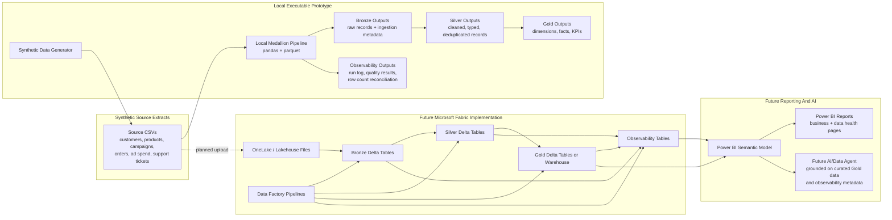

# Architecture Diagram

This Mermaid diagram summarizes the current local prototype and the planned Microsoft Fabric implementation path.

```mermaid
flowchart LR
    subgraph Sources["Synthetic Source Extracts"]
        CSV["Source CSVs<br/>customers, products, campaigns,<br/>orders, ad spend, support tickets"]
    end

    subgraph Local["Local Executable Prototype"]
        Generator["Synthetic Data Generator"]
        LocalPipeline["Local Medallion Pipeline<br/>pandas + parquet"]
        Bronze["Bronze Outputs<br/>raw records + ingestion metadata"]
        Silver["Silver Outputs<br/>cleaned, typed, deduplicated records"]
        Gold["Gold Outputs<br/>dimensions, facts, KPIs"]
        Obs["Observability Outputs<br/>run log, quality results,<br/>row count reconciliation"]
    end

    subgraph FutureFabric["Future Microsoft Fabric Implementation"]
        OneLake["OneLake / Lakehouse Files"]
        FabricBronze["Bronze Delta Tables"]
        FabricSilver["Silver Delta Tables"]
        FabricGold["Gold Delta Tables or Warehouse"]
        Pipelines["Data Factory Pipelines"]
        FabricObs["Observability Tables"]
    end

    subgraph Reporting["Future Reporting And AI"]
        Semantic["Power BI Semantic Model"]
        Reports["Power BI Reports<br/>business + data health pages"]
        Agent["Future AI/Data Agent<br/>grounded on curated Gold data<br/>and observability metadata"]
    end

    Generator --> CSV
    CSV --> LocalPipeline
    LocalPipeline --> Bronze
    Bronze --> Silver
    Silver --> Gold
    LocalPipeline --> Obs

    CSV -.planned upload.-> OneLake
    OneLake --> FabricBronze
    FabricBronze --> FabricSilver
    FabricSilver --> FabricGold
    Pipelines --> FabricBronze
    Pipelines --> FabricSilver
    Pipelines --> FabricGold
    Pipelines --> FabricObs
    FabricBronze --> FabricObs
    FabricSilver --> FabricObs
    FabricGold --> FabricObs

    FabricGold --> Semantic
    FabricObs --> Semantic
    Semantic --> Reports
    Semantic --> Agent
```
