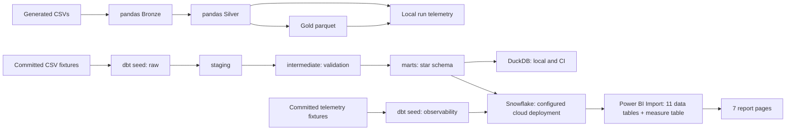

# Architecture diagram

Two independently runnable implementations use separate synthetic inputs. Only the Snowflake deployment feeds the Power BI report.

Generated parquet and local run telemetry do not automatically update Snowflake or the report. Report operations data is seeded demonstration telemetry. See [architecture and limitations](../docs/architecture.md).
