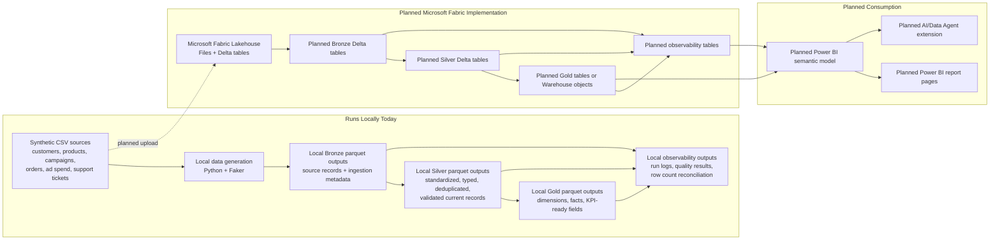

# Demo Architecture Overview

This diagram separates what runs locally today from the planned Microsoft Fabric, Power BI, and AI/Data Agent implementation path.

The local prototype is executable today. Microsoft Fabric execution, Power BI report creation, and the AI/Data Agent extension are planned unless a later implementation note documents otherwise.
