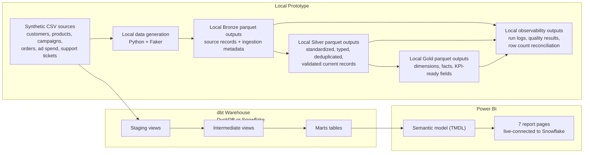

# Demo Architecture Overview

This diagram shows the local pandas prototype alongside the dbt warehouse path (DuckDB or Snowflake) that feeds the live-connected Power BI report.

The local prototype and the dbt warehouse (both targets) are executable today; the Power BI report is built and connected live.
