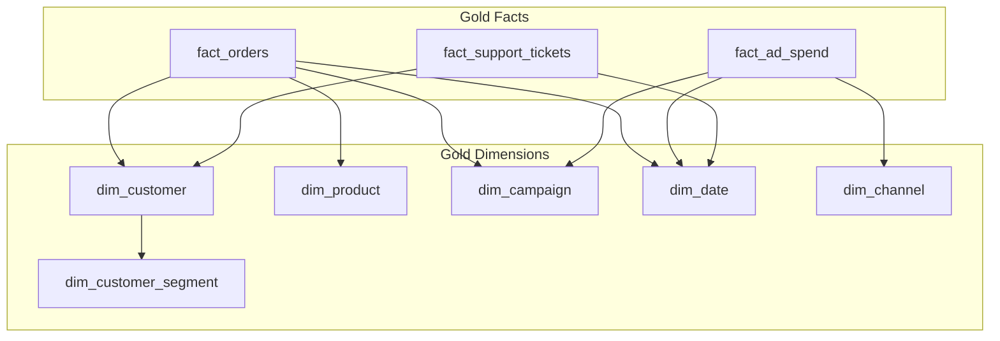

# Demo Gold Model

This diagram summarizes the planned Gold dimensional model used by the local prototype and intended for a future Power BI semantic model.

The Gold model supports business-ready measures for revenue, margin, marketing performance, customer analysis, support quality, and data health. Power BI execution is planned unless documented later.
