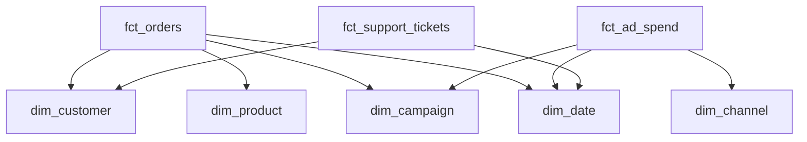

# Report Gold model

The current Power BI model imports five business dimensions and three facts from dbt marts, plus three seeded observability tables. Customer segment is an attribute of dim_customer; the separate warehouse segment dimension is not imported.

```mermaid
flowchart TB
    fct_orders --> dim_customer
    fct_orders --> dim_product
    fct_orders --> dim_campaign
    fct_orders --> dim_date
    fct_ad_spend --> dim_campaign
    fct_ad_spend --> dim_channel
    fct_ad_spend --> dim_date
    fct_support_tickets --> dim_customer
    fct_support_tickets --> dim_date
```

Relationships filter from dimensions to facts. See [metric definitions](../../docs/business_metrics.md) for payment/refund filters, campaign attribution, and customer counting.
